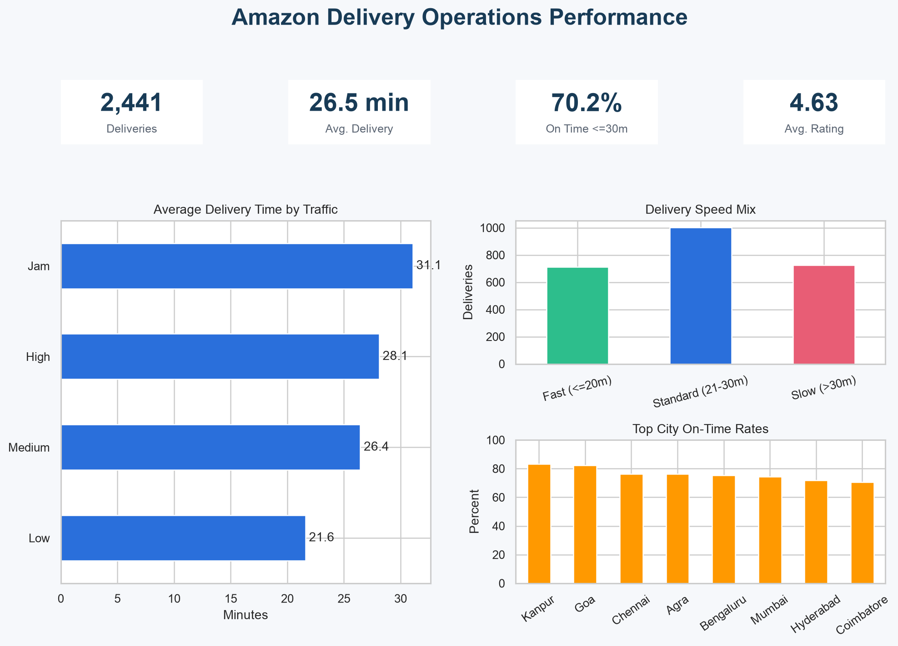

# Amazon Delivery Performance Analysis

An end-to-end business analytics project that cleans a Kaggle delivery dataset, validates data quality, develops operational KPIs, and prepares an interactive Tableau Public dashboard.



## Business question

Which operating conditions are associated with slower delivery times, and where should a delivery operation focus first to improve the customer experience?

## Headline results

| KPI | Result |
|---|---:|
| Cleaned deliveries | 2,441 |
| Average delivery time | 26.49 min |
| Median delivery time | 26.00 min |
| Deliveries completed within 30 minutes | 70.22% |
| Average courier rating | 4.63 / 5 |
| Average straight-line distance | 9.86 km |
| Average pickup delay | 9.98 min |

The 30-minute measure is a project benchmark for comparing segments; it is not an Amazon service-level commitment.

## Key insights

- **Traffic is the clearest operational constraint.** Orders during traffic jams averaged 31.08 minutes and only 51.84% were completed within 30 minutes. Under low traffic, average time fell to 21.60 minutes and the within-30-minute rate rose to 92.44%.
- **Weather compounds delivery risk.** Fog produced an average delivery time of 30.02 minutes and a 55.86% within-30-minute rate, compared with 21.92 minutes and 87.66% in sunny conditions.
- **Evening demand is a priority window.** Evening deliveries averaged 29.00 minutes, versus 22.03 minutes in the morning.
- **Festival orders were unusually slow.** The 46 festival orders averaged 46.28 minutes and none met the 30-minute benchmark. This is a small subgroup and should be validated with more data before changing policy.
- **Vehicle comparisons may reflect assignment patterns.** Scooters averaged 27.72 minutes, while motorcycles averaged 23.98 minutes. This is descriptive, not causal, because vehicle choice may depend on route and order conditions.

## Data-cleaning workflow

1. Removed the exported index and one duplicate delivery ID.
2. Replaced invalid ages outside 18–45 and ratings outside 1–5 with missing values, then imputed transparent medians.
3. Filled missing multiple-delivery counts with the mode.
4. Decoded weather, traffic, order, vehicle, and festival category codes using the companion dataset files.
5. Normalized malformed time values, calculated order-to-pickup delay, and flagged implausible delays above two hours.
6. Corrected erroneous negative coordinate signs, kept coordinates inside plausible India bounds, and calculated Haversine distance.
7. Engineered city, order-period, age-band, rating-band, delivery-speed, and 30-minute benchmark fields.
8. Exported a clean analysis file, Tableau-ready data, quality metrics, summary tables, and charts.

See [`data_quality_report.json`](data_quality_report.json) for the complete cleaning audit and [`DATA_DICTIONARY.md`](DATA_DICTIONARY.md) for the analytical fields.

## Repository structure

```text
.
├── amazon_delivery_analysis.py       # Reproducible cleaning and analysis pipeline
├── data/processed/                   # Cleaned analysis dataset
├── tableau/                          # Tableau-ready dataset
├── summary_tables/                   # Aggregated KPI tables
├── figures/                          # Portfolio charts and dashboard preview
├── business_metrics.json             # Headline KPIs
├── data_quality_report.json          # Cleaning audit
├── DATA_DICTIONARY.md
└── requirements.txt
```

## Reproduce the analysis

Download `updated.csv` from the Kaggle source, then run:

```bash
python -m pip install -r requirements.txt
python amazon_delivery_analysis.py \
  --input /path/to/updated.csv \
  --output .
```

## Data source and license

- Kaggle: [Amazon Business Research Analyst Dataset](https://www.kaggle.com/datasets/vikramxd/amazon-business-research-analyst-dataset)
- Dataset license: CC0 Public Domain

The source is a practice dataset and is not verified as internal Amazon operational data. The labeled file contains 2,442 rows before cleaning, so results should be treated as exploratory portfolio analysis rather than business policy evidence.

## Tools

Python, pandas, NumPy, Matplotlib, Seaborn, and Tableau Public.

## Author

**Phan Bao Ngoc (Clara) Nguyen**  
Business Analytics, Honors College — Kent State University

